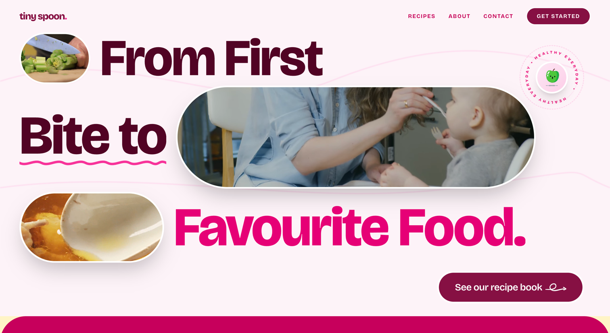
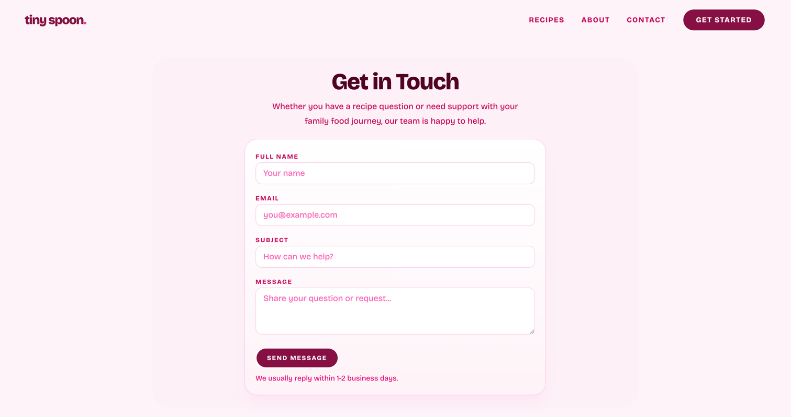

# Tiny Spoon

Tiny Spoon is a responsive multi-page website created for parents and caregivers who are looking for simple, healthy, and age-appropriate recipes for babies and young children. The website was developed as part of a frontend web development project and focuses on building a calm, friendly, and easy-to-use experience for families.

The main idea behind Tiny Spoon is to offer a small digital space where users can explore recipe content, learn more about the purpose of the platform, and reach out through a contact form if they have questions, feedback, or suggestions. Since the website is centered around children’s nutrition, the design was planned to feel soft, welcoming, and clear rather than busy or overly decorative.

This project was built using React, TypeScript, Tailwind CSS, and JavaScript, with a strong focus on responsive design, accessibility, semantic structure, and user-friendly navigation.

---

# Project Overview



The purpose of Tiny Spoon is to create a website that feels approachable and supportive for parents of babies and toddlers. Rather than trying to include too many features, the project focuses on doing the essentials well: presenting content clearly, making navigation simple, and providing a contact page that is easy to use.

From the beginning, I wanted the website to feel calm and trustworthy. Since the subject is baby and children’s recipes, it was important that the interface did not feel too corporate, too loud, or too complicated. The overall structure and styling decisions were made with that goal in mind.

Tiny Spoon includes four main pages as required for the project:

- Home
- About
- Recipes
- Contact

---

# User Experience

## Project Goals

The main goal of this project was to design and develop a website that would be useful and easy to understand for parents and caregivers. The site needed to be visually clear, responsive across devices, and accessible to users with different needs.

More specifically, the goals of Tiny Spoon were:

- to present baby-friendly recipe content in an organised and readable way
- to create a warm and supportive visual identity
- to provide clear navigation between pages
- to include a contact page with form validation
- to apply good frontend development practices using modern web technologies

## Target Users

The website is intended mainly for:

- parents of babies and toddlers
- caregivers and guardians
- families looking for child-friendly recipe inspiration

These users are likely to value simplicity, readability, and trust. Because of that, the design was kept clean and the information was structured in a straightforward way.

## User Needs

A user visiting Tiny Spoon should be able to:

- understand what the website is about quickly
- move between pages without confusion
- read content comfortably on desktop or mobile
- contact the website easily through a simple form
- receive clear feedback if they submit invalid form information

---

# Website Structure
Tiny Spoon is a multi-page website made up of four main sections.

## Home Page

The Home page introduces the website and gives users a first impression of the platform. Its role is to welcome visitors, communicate the purpose of Tiny Spoon, and guide them toward the other parts of the site.

## About Page

The About page explains the purpose of the website in more detail. It helps users understand the idea behind Tiny Spoon and why the platform focuses on recipes for babies and young children.

## Recipes Page

The Recipes page is the main theme-related content page of the website. It presents recipe content in a clear and organised format so that users can explore meal ideas more easily.

## Contact Page

The Contact page allows users to get in touch through a form. It includes labeled fields, frontend validation, inline error handling, and success feedback after valid submission. The page was intentionally kept simple so that the form remains the main focus.

---

# Planning and Design Process

Before starting development, I thought about the type of user the website was meant for and the feeling the design should create. Since the audience is parents and caregivers, the site needed to feel gentle, readable, and trustworthy.

I planned the structure of the site first by deciding which pages were essential and what each page should communicate. I then considered layout, spacing, color use, and typography so that the design would remain consistent across the whole website.

The visual direction was influenced by the idea of making the site feel soft and modern without becoming childish. I wanted the pages to have enough personality to feel warm, but not so many visual elements that they became distracting.

The Contact page especially went through several refinements. At first, the layout included additional content blocks that made the page feel too heavy and distracting. After reviewing the design, I simplified the page so that the form became the central focus. This made the contact experience clearer and more consistent with the rest of the website.

---

# Design Choices

## Color Palette

The project uses an explicit brand palette defined in `src/index.css` with two scales: `brand-*` and `brandBlue-*`.

Main pink brand scale used across the UI:

- `brand-50`: `#fdf2f8`
- `brand-100`: `#fce7f3`
- `brand-200`: `#fccee8`
- `brand-300`: `#fda5d5`
- `brand-400`: `#fb64b6`
- `brand-500`: `#f6339a`
- `brand-600`: `#e60076`
- `brand-700`: `#c6005c`
- `brand-800`: `#a3004c`
- `brand-900`: `#861043`
- `brand-950`: `#510424`

Secondary blue scale available in the theme:

- `brandBlue-50`: `#f0f9ff`
- `brandBlue-100`: `#dff2fe`
- `brandBlue-200`: `#b8e6fe`
- `brandBlue-300`: `#74d4ff`
- `brandBlue-400`: `#00bcff`
- `brandBlue-500`: `#00a6f4`
- `brandBlue-600`: `#0084d1`
- `brandBlue-700`: `#0069a8`
- `brandBlue-800`: `#00598a`
- `brandBlue-900`: `#024a70`
- `brandBlue-950`: `#052f4a`

How these colors are used in the current implementation:

- soft backgrounds and sections: mostly `brand-50` and `brand-100` tones
- headings and strong text: `brand-900` and `brand-950`
- buttons and call-to-action elements: deeper brand tones (for example `brand-900`)
- cards and form surfaces: white/light surfaces with `brand-100/200` borders
- visual accents in hero elements: bright pink highlights from the brand scale

This palette suits a baby/kids recipe website because it feels warm, gentle, and reassuring while still giving clear visual hierarchy for actions and important content.

## Typography

Typography is configured in `src/index.css` using:

- `--font-bricolage: 'Bricolage Grotesque'`

and applied globally via `font-family: var(--font-bricolage);`.

In practice, the typography style follows a clear hierarchy:

- large, bold headings (`font-black`) for section emphasis
- softer body text with comfortable line-height for readability
- compact uppercase labels in UI/form areas for clarity

This combination supports readability and gives the interface a modern but approachable tone.

## Layout and Visual Style

The overall layout of Tiny Spoon is based on clarity and breathing space. Content is organised into distinct sections so that users can scan the page naturally without feeling overwhelmed. Spacing is used carefully to separate different blocks of information and create a calmer browsing experience.

The design avoids overcrowding. Instead of adding too many decorative elements, the visual style relies on balanced spacing, rounded cards, soft gradients/surfaces, and a consistent structure across pages.

The Contact page reflects this approach clearly. After several iterations, it was simplified into a more focused layout with a centered form, short introduction, and minimal distractions.

Overall, the visual style of Tiny Spoon is warm, readable, and parent-friendly while still following modern frontend design practices.

---

# Features

The website includes the following key features.

## Responsive Navigation

A shared navigation bar allows users to move easily between the pages of the site. This supports one of the main project requirements, which is easy and intuitive navigation.

## Multi-Page Structure

The website includes four separate pages, as required by the project brief:

- Home
- About
- Recipes
- Contact

## Responsive Design

The layout adapts to different screen sizes, including desktop, tablet, and mobile devices. This was implemented through responsive CSS techniques such as media queries, flexible containers, and breakpoint-based utility classes.

## Contact Form

The Contact page includes a form with the following fields:

- Full Name
- Email
- Subject
- Message

The form includes frontend validation so that:

- all fields must be completed
- the email must be in a valid format
- the message must meet a minimum length
- invalid submissions show inline errors
- valid submissions show a success message and clear the form

## Accessibility Considerations

Accessibility was part of the development process throughout the project. For example:

- semantic elements are used
- form inputs have associated labels
- field errors are tied to their inputs
- validation and status feedback are clearly presented
- page structure supports readability and usability

---

# Technologies Used

## Languages and Core Technologies

- TypeScript
- JavaScript (runtime behavior)
- HTML (rendered semantic structure)
- CSS (through Tailwind utility classes and theme tokens)

## Libraries and Tools

- React
- React Router
- Tailwind CSS
- Framer Motion
- GSAP
- Vite
- Git and GitHub for version control

No content management system was used in this project.

---

# Semantic HTML and Accessibility

One of the project requirements was the use of semantic HTML, and this was an important part of the build. Elements such as `main`, `section`, `form`, `label`, `input`, `textarea`, and `button` were used where appropriate to improve both structure and accessibility.

Accessibility was also considered through:

- proper form labeling
- clear visual hierarchy
- readable text sizes
- meaningful page structure
- feedback messages for form interactions

The goal was to make the website more usable for a wide range of visitors, while also following good web development practice.

---

# Responsive Design

Tiny Spoon was designed to work across different device sizes. During development, layouts were adjusted to ensure that text remains readable, spacing feels balanced, and interactive elements remain easy to use on smaller screens.

The website was tested on desktop, tablet, and mobile screen sizes. Responsive behavior was achieved using:

- flexible containers
- responsive widths
- breakpoint-based layout adjustments
- spacing and typography scaling

---

# Testing

Testing was an important part of the development process.

## Manual Testing

The website was manually tested throughout development to check that:

- navigation links work correctly
- each page loads as expected
- the layout adapts well to different screen sizes
- the contact form behaves correctly
- validation messages appear when required
- success feedback appears only when the form is valid

## Contact Form Testing

The contact form was checked to make sure that:

- empty fields do not submit
- invalid email formats are rejected
- error messages are shown near the correct field
- success messages only appear after valid input
- the form clears after a successful submission

## Responsive Testing

The layout was reviewed on multiple screen sizes using browser developer tools to confirm that the website remains usable and visually consistent on smaller devices.

---

# Challenges and Improvements

One of the main areas that required revision during the project was the Contact page. Early versions included additional content blocks that made the page feel too heavy and distracting. After reviewing the layout, the design was simplified so that the form became the central focus.

Another important improvement was form validation. At one stage, the form displayed a success message even when the email format was incorrect. This was resolved by adding proper frontend validation and making sure the success state only appears after all fields are valid.

These changes improved both usability and the overall quality of the final page.

---

# How to Run the Project Locally

To run this project locally:

1. Clone or download the repository.
2. Open the project folder in a terminal.
3. Install dependencies.
4. Start the development server.

Commands:

```bash
npm install
npm run dev
```

Then open the local Vite URL shown in your terminal (typically `http://localhost:5173`).

---

# Deployment

This project can be deployed with static hosting providers. The repository already includes Firebase Hosting configuration files:

- `firebase.json`
- `.firebaserc`

If deployed, the live project link can be added here.

---

# Code Quality and Best Practices

Throughout the project, effort was made to keep the code clean, readable, and organised. Structure, naming, and layout decisions were made with maintainability in mind.

The project also aimed to follow best practices by:

- keeping styling consistent
- using semantic structure
- validating form inputs
- making the site responsive
- maintaining a clear page architecture
