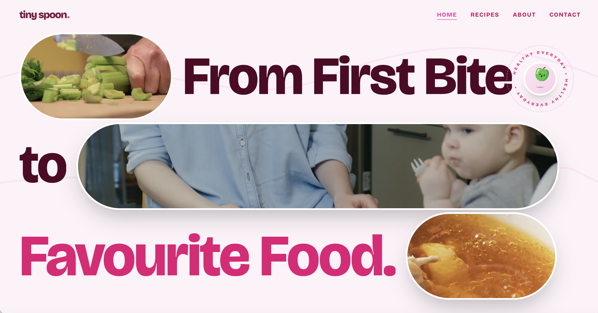
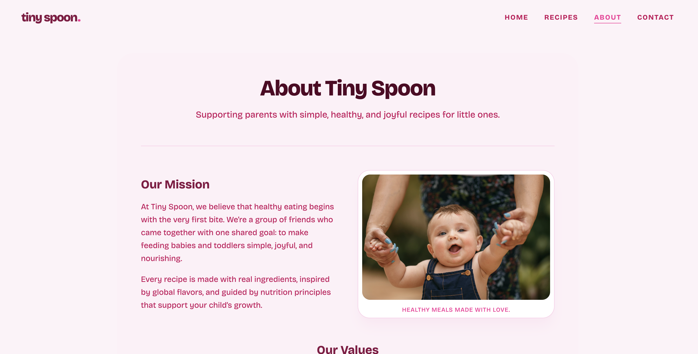
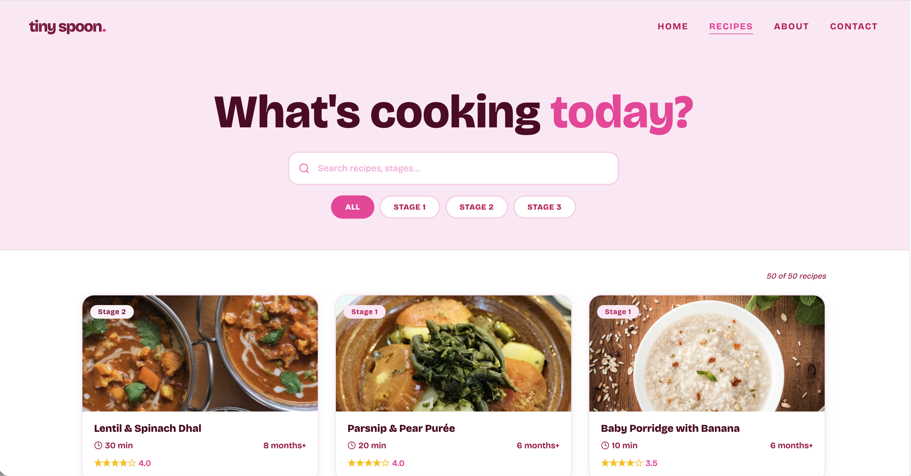
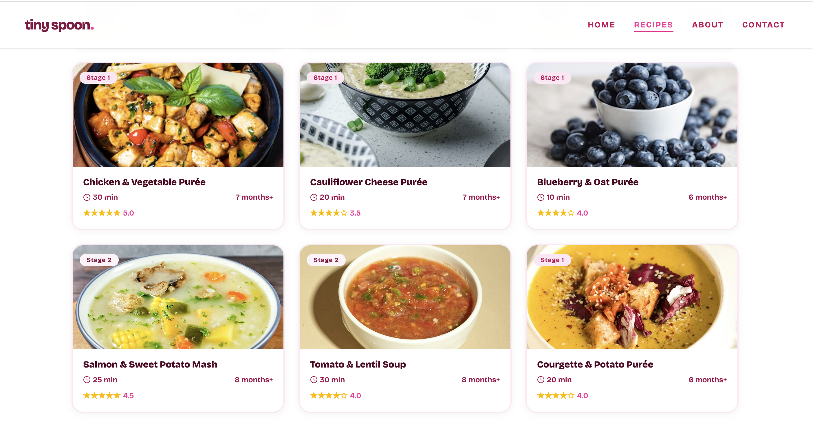
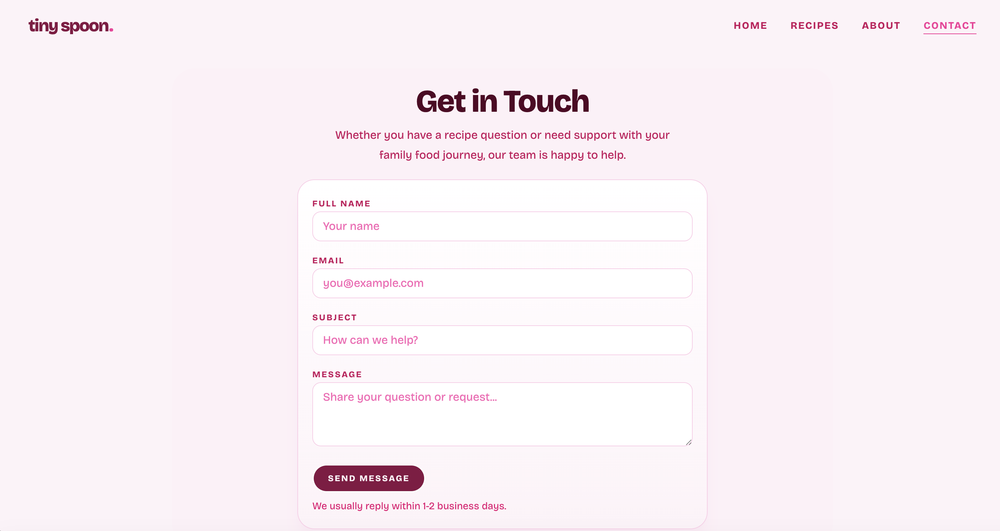
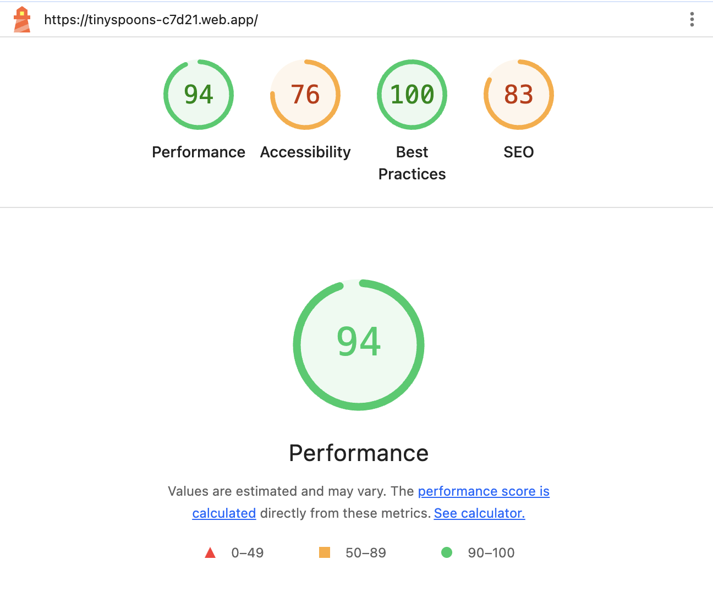

# Tiny Spoon

Tiny Spoon is a responsive multi-page website created for parents and caregivers who are looking for simple, healthy, and age-appropriate recipes for babies and young children. The website was developed as part of a group frontend web development project and focuses on building a calm, friendly, and easy-to-use experience for families.

The main idea behind Tiny Spoon is to offer a small digital space where users can explore recipe content, learn more about the purpose of the platform, and reach out through a contact form if they have questions, feedback, or suggestions. Since the website is centered around children’s nutrition, the design was planned to feel soft, welcoming, and clear rather than busy or overly decorative.

This project was built using React, TypeScript, Tailwind CSS, and JavaScript, with a strong focus on responsive design, accessibility, semantic structure, and user-friendly navigation.

[Live Website - Tiny Spoon](https://tinyspoons-c7d21.web.app/)

---

# How to Run the Project Locally

To run this project locally:

1. Clone or download the repository.
2. Open the project folder in a terminal.
3. Install dependencies.
4. Start the development server.

## Commands

```bash
npm install
npm run dev
```

Then open the local Vite URL shown in your terminal, typically:

```bash
http://localhost:5173
```

---

# Project Overview



The purpose of Tiny Spoon is to create a website that feels approachable and supportive for parents of babies and toddlers. Rather than trying to include too many features, the project focuses on doing the essentials well: presenting content clearly, making navigation simple, and providing a contact page that is easy to use.

From the beginning, we wanted the website to feel calm and trustworthy. Since the subject is baby and children’s recipes, it was important that the interface did not feel too corporate, too loud, or too complicated. The overall structure and styling decisions were made with that goal in mind.

Tiny Spoon includes four main pages as required for the project:

- Home
- About
- Recipes
- Contact

---

# User Experience

## Project Goals

The main goal of this project was to design and develop a website that would be useful and easy to understand for parents and caregivers. The site needed to be visually clear, responsive across devices, and accessible to users with different needs.

More specifically, the goals of Tiny Spoon were:

- To present the Tiny Spoon brand as trustworthy, warm, and supportive in early childhood nutrition.
- To allow users to browse and filter recipes by age stage.
- To help users understand the brand through the About and Contact pages, building credibility and trust.
- To deliver a responsive website experience across mobile, tablet, and desktop devices.

---

# Website Structure

Tiny Spoon is a multi-page website made up of four main sections.

## Home Page

The Home page introduces the website and gives users a first impression of the platform. Its role is to welcome visitors, communicate the purpose of Tiny Spoon, and guide them toward the other parts of the site.


## About Page

The About page explains the purpose of the website in more detail. It helps users understand the idea behind Tiny Spoon and why the platform focuses on recipes for babies and young children.



## Recipes Page

The Recipes page is the main theme-related content page of the website. It presents recipe content in a clear and organised format so that users can explore meal ideas more easily.




## Contact Page

The Contact page allows users to get in touch through a form. It includes labeled fields, frontend validation, inline error handling, and success feedback after valid submission. The page was intentionally kept simple so that the form remains the main focus.



---

# Planning and Design Process

Before starting development, we thought about the type of user the website was meant for and the feeling the design should create. Since the audience is parents and caregivers, the site needed to feel gentle, readable, and trustworthy.

We planned the structure of the site first by deciding which pages were essential and what each page should communicate. We then considered layout, spacing, color use, and typography so that the design would remain consistent across the whole website.

The visual direction was influenced by the idea of making the site feel soft and modern without becoming childish. We wanted the pages to have enough personality to feel warm, but not so many visual elements that they became distracting.

The Contact page especially went through several refinements. At first, the layout included additional content blocks that made the page feel too heavy and distracting. After reviewing the design, we simplified the page so that the form became the central focus. This made the contact experience clearer and more consistent with the rest of the website.

---

# Design Choices

## Color Palette

The project uses an explicit brand palette defined in `src/index.css` with two scales: `brand-*` and `brandBlue-*`.

Main pink brand scale used across the UI:

- `brand-50`: `#fdf2f8`
- `brand-100`: `#fce7f3`
- `brand-200`: `#fccee8`
- `brand-300`: `#fda5d5`
- `brand-400`: `#fb64b6`
- `brand-500`: `#f6339a`
- `brand-600`: `#e60076`
- `brand-700`: `#c6005c`
- `brand-800`: `#a3004c`
- `brand-900`: `#861043`
- `brand-950`: `#510424`

How these colors are used in the current implementation:

- Soft backgrounds and sections mainly use `brand-50` and `brand-100`.
- Headings and strong text use `brand-900` and `brand-950`.
- Buttons and call-to-action elements use deeper brand tones such as `brand-900`.
- Cards and form surfaces use light backgrounds with `brand-100` or `brand-200` borders.
- Visual accents in hero elements use brighter pink highlights from the brand scale.

This palette suits a baby and kids recipe website because it feels warm, gentle, and reassuring while still giving clear visual hierarchy for actions and important content.

## Typography

Typography is configured in `src/index.css` using:

- `--font-bricolage: 'Bricolage Grotesque'`

and applied globally via:

```css
font-family: var(--font-bricolage);
```

In practice, the typography style follows a clear hierarchy:

- Large, bold headings for section emphasis
- Softer body text with comfortable line-height for readability
- Compact uppercase labels in UI and form areas for clarity

This combination supports readability and gives the interface a modern but approachable tone.

## Layout and Visual Style

The overall layout of Tiny Spoon is based on clarity and breathing space. Content is organised into distinct sections so that users can scan the page naturally without feeling overwhelmed. Spacing is used carefully to separate different blocks of information and create a calmer browsing experience.

The design avoids overcrowding. Instead of adding too many decorative elements, the visual style relies on balanced spacing, rounded cards, soft gradients and surfaces, and a consistent structure across pages.

The Contact page reflects this approach clearly. After several iterations, it was simplified into a more focused layout with a centered form, short introduction, and minimal distractions.

Overall, the visual style of Tiny Spoon is warm, readable, and parent-friendly while still following modern frontend design practices.

---

# Features

The website includes the following key features.

## Responsive Navigation

A shared navigation bar allows users to move easily between the pages of the site. This supports one of the main project requirements, which is easy and intuitive navigation.

## Multi-Page Structure

The website includes four separate pages, as required by the project brief:

- Home
- About
- Recipes
- Contact

## Responsive Design

The layout adapts to different screen sizes, including desktop, tablet, and mobile devices. This was implemented through responsive CSS techniques such as media queries, flexible containers, and breakpoint-based utility classes.

## Contact Form

The Contact page includes a form with the following fields:

- Full Name
- Email
- Subject
- Message

The form includes frontend validation so that:

- all fields must be completed
- the email must be in a valid format
- the message must meet a minimum length
- invalid submissions show inline errors
- valid submissions show a success message and clear the form

## Accessibility Considerations

Accessibility was part of the development process throughout the project. For example:

- semantic elements are used
- form inputs have associated labels
- field errors are tied to their inputs
- validation and status feedback are clearly presented
- page structure supports readability and usability

---

# Technologies Used

## Languages and Core Technologies

- TypeScript
- JavaScript
- HTML
- CSS
- React
- Tailwind CSS
- Vite

## Semantic HTML and Accessibility

One of the project requirements was the use of semantic HTML, and this was an important part of the build. Elements such as `main`, `section`, `form`, `label`, `input`, `textarea`, and `button` were used where appropriate to improve both structure and accessibility.

Accessibility was also considered through:

- proper form labeling
- clear visual hierarchy
- readable text sizes
- meaningful page structure
- feedback messages for form interactions

The goal was to make the website more usable for a wide range of visitors while also following good web development practice.

---

# Responsive Design

Tiny Spoon was designed to work across different device sizes. During development, layouts were adjusted to ensure that text remains readable, spacing feels balanced, and interactive elements remain easy to use on smaller screens.

The website was tested on desktop, tablet, and mobile screen sizes. Responsive behavior was achieved using:

- flexible containers
- responsive widths
- breakpoint-based layout adjustments
- spacing and typography scaling

---

# Testing and Validation

Testing was an important part of the development process.

## Manual Testing

The website was manually tested throughout development to check that:

- navigation links work correctly
- each page loads as expected
- the layout adapts well to different screen sizes
- the contact form behaves correctly
- validation messages appear when required
- success feedback appears only when the form is valid

## Contact Form Testing

The contact form was checked to make sure that:

- empty fields do not submit
- invalid email formats are rejected
- error messages are shown near the correct field
- success messages only appear after valid input
- the form clears after a successful submission

## Responsive Testing

The layout was reviewed on multiple screen sizes using browser developer tools to confirm that the website remains usable and visually consistent on smaller devices.

## Lighthouse Testing

Lighthouse was used to evaluate the site in key categories such as performance, accessibility, best practices, and SEO.

The audit results were:

- Performance: 94
- Accessibility: 76
- Best Practices: 100
- SEO: 83



These results show that the website performs well overall, follows strong development practices, and has a good technical foundation. The accessibility score also highlighted areas where further improvements could still be made.

---

# Challenges and Improvements

One of the main areas that required revision during the project was the Contact page. Early versions included additional content blocks that made the page feel too heavy and distracting. After reviewing the layout, the design was simplified so that the form became the central focus.

Another important improvement was form validation. At one stage, the form displayed a success message even when the email format was incorrect. This was resolved by adding proper frontend validation and making sure the success state only appears after all fields are valid.

These changes improved both usability and the overall quality of the final page.

---

# Conclusion

Tiny Spoon was created as a group project to deliver a calm, welcoming, and easy-to-use website for parents and caregivers looking for baby and toddler recipe ideas. The final result reflects a balance between visual warmth, responsive design, and practical usability.

Through this project, we strengthened our understanding of React development, responsive layout design, accessibility, and user-centered interface decisions. The project also showed the importance of iteration, especially when refining layout simplicity and form validation.

Overall, Tiny Spoon demonstrates a thoughtful and user-friendly frontend solution built with modern web technologies.

---

# Live Project

[View the live project here](https://tinyspoons-c7d21.web.app/)